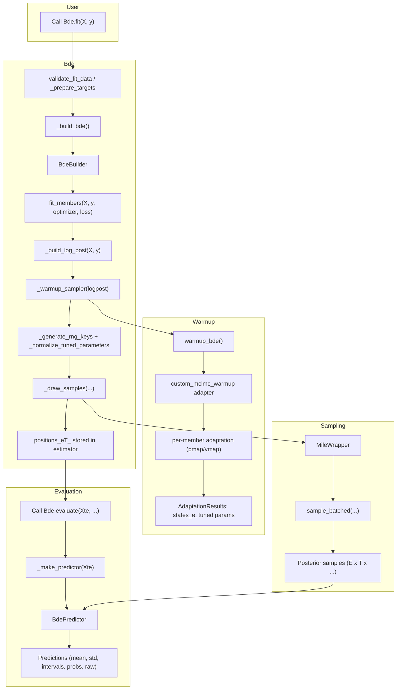

bde: Bayesian Deep Ensembles for scikit-learn and JAX
====================================================


[](https://codecov.io/gh/scikit-learn-contrib/bde)


Introduction
------------

**bde** is a user-friendly implementation of Bayesian Deep Ensembles compatible with
both scikit-learn and JAX. It exposes estimators that plug into scikit-learn
pipelines while leveraging JAX for accelerator-backed training, sampling, and
uncertainty estimation.

In particular, **bde** implements **Microcanonical Langevin Ensembles (MILE)** as
introduced in [*Microcanonical Langevin Ensembles: Advancing the Sampling of Bayesian Neural Networks* (ICLR 2025)](https://arxiv.org/abs/2502.06335).


Installation
------------

```
pip install --index-url <pending-release-url> bde
```

The public package index is not published yet; the command above is a placeholder
for the upcoming release.

Dependency Management
---------------------

We recommend using [pixi](https://prefix.dev/docs/pixi/overview) to create a
deterministic development environment:

```
pixi install
pixi run python -m examples.example
```

Pixi ensures the correct JAX, CUDA (when needed), and scikit-learn versions are
selected automatically. See `pixi.toml` for channel and platform details.

Example Usage
-------------

Minimal runnable scripts live in `examples/`, and the snippets below highlight the
most common regression and classification workflows. When running outside those
scripts, remember to set the XLA device count so JAX allocates enough host devices:
NOTE MENTNION THAT HTHE EXPORT NEEDS TO BE DONE BEFORE JAX
```
export XLA_FLAGS="--xla_force_host_platform_device_count=8" 
```

Adjust the value to match the number of CPU (or GPU) devices you plan to use.

### Regression Example

```python
import os

os.environ["XLA_FLAGS"] = "--xla_force_host_platform_device_count=8"

import jax.numpy as jnp
from sklearn.datasets import fetch_openml
from sklearn.metrics import root_mean_squared_error
from sklearn.model_selection import train_test_split

from bde import BdeRegressor
from bde.loss import GaussianNLL


data = fetch_openml(name="airfoil_self_noise", as_frame=True)
X = data.data.values  # shape (1503, 5)
y = data.target.values.reshape(-1, 1)  # shape (1503, 1)

X_train, X_test, y_train, y_test = train_test_split(
   X,
   y,
   test_size=0.2,
   random_state=0,
)
# Normalize data
Xmu, Xstd = jnp.mean(X_train, 0), jnp.std(X_train, 0) + 1e-8
Ymu, Ystd = jnp.mean(y_train, 0), jnp.std(y_train, 0) + 1e-8

Xtr = (X_train - Xmu) / Xstd
Xte = (X_test - Xmu) / Xstd
ytr = (y_train - Ymu) / Ystd
yte = (y_test - Ymu) / Ystd

regressor = BdeRegressor(
    hidden_layers=[16, 16],
    n_members=20,
    seed=0,
    loss=GaussianNLL(),
    epochs=200,
    lr=1e-3,
    warmup_steps=500,
    n_samples=100,
    n_thinning=1,
    patience=10,
)

regressor.fit(x=Xtr, y=ytr)

mean, std = regressor.predict(jnp.array(X_test), mean_and_std=True)
mu, intervals = regressor.predict(Xte, credible_intervals=[0.9, 0.95])
raw = regressor.predict(Xte, raw=True)
print("RSME: ", root_mean_squared_error(y_true=yte, y_pred=mean))
score = regressor.score(Xtr, ytr)
print(f"the sklearn score is {score}")


```

### Classification Example

```python
import os

os.environ["XLA_FLAGS"] = "--xla_force_host_platform_device_count=8"

from sklearn.datasets import load_iris
from sklearn.model_selection import train_test_split

from bde import BdeClassifier
from bde.loss import CategoricalCrossEntropy

iris = load_iris()
X = iris.data.astype("float32")
y = iris.target.astype("int32").ravel()
X_train, X_test, y_train, y_test = train_test_split(
    X, y, test_size=0.2, random_state=42)
classifier = BdeClassifier(
    n_members=2,
    hidden_layers=[16, 16],
    seed=0,
    loss=CategoricalCrossEntropy(),
    activation="relu",
    epochs=4,
    lr=1e-3,
    warmup_steps=50,
    n_samples=2,
    n_thinning=1,
    patience=2
    )
classifier.fit(x=X_train, y=y_train)
preds = classifier.predict(X_test)
probs = classifier.predict_proba(X_test)
score = classifier.score(X_train, y_train)
raw = classifier.predict(X_test, raw=True)
print("Predicted class probabilities:\n", probs)
print("Predicted class labels:\n", preds)
print("True labels:\n", y_test)
print(f"the sklearn score is {score}")
print(f"The shape of the raw predictions are {raw.shape}")
```

Workflow
--------

The high-level estimators follow this flow during `fit` and evaluation:

- `BdeRegressor` / `BdeClassifier` (`bde/bde.py`) delegate to the shared `Bde` base class.
- `Bde.fit` validates data, resolves defaults, and calls `_build_bde()` to instantiate `BdeBuilder`.
- `BdeBuilder.fit_members` (`bde/bde_builder.py`) trains each network, handles device padding, and applies early stopping.
- `_build_log_post` constructs the ensemble log-posterior, then `warmup_bde` (`bde/sampler/warmup.py`) adapts step sizes before sampling.
- Sampler utilities (`bde/sampler/*`) draw posterior samples and cache them for downstream prediction.
- `Bde.evaluate` / predictor utilities (`bde/bde_evaluator.py`) aggregate samples into means, intervals, and probabilities.


