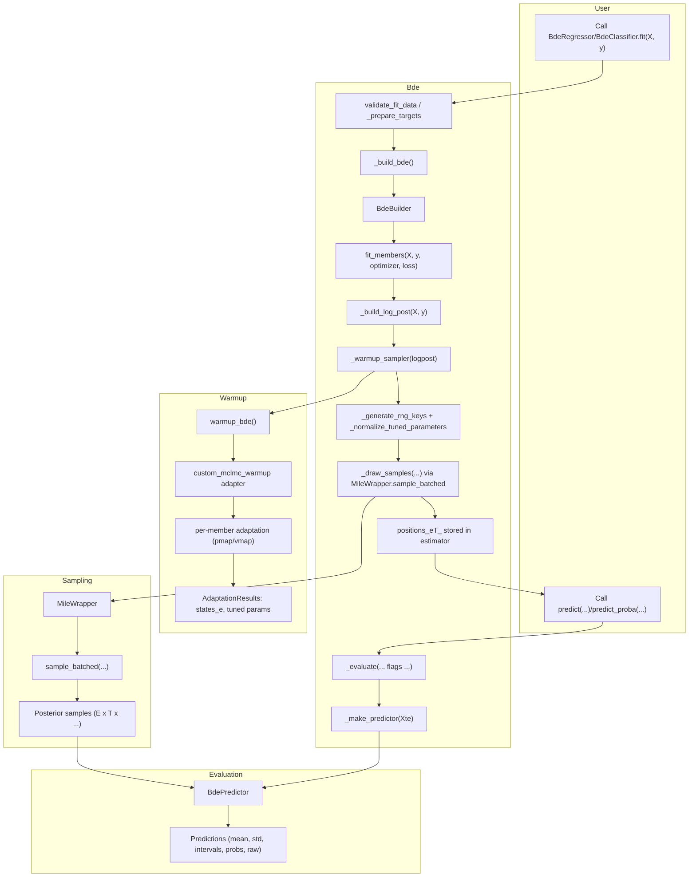

# Bayesian Deep Ensembles for scikit-learn <a href="https://github.com/vyron-arvanitis/bde">
[](https://github.com/vyron-arvanitis/bde/actions/workflows/deploy-gh-pages.yml)
[](https://github.com/vyron-arvanitis/bde/actions/workflows/python-app.yml)

[](LICENSE)


Installation
------------

```
pip install git+https://github.com/vyron-arvanitis/bde.git
```

The public package index is not published yet; the command above is a placeholder
for the upcoming release.

Dependency Management
---------------------

We recommend using [pixi](https://prefix.dev/docs/pixi/overview) to create a
deterministic development environment:

```
pixi install
pixi run python -m examples.example
```

Pixi ensures the correct JAX, CUDA (when needed), and scikit-learn versions are
selected automatically. See `pixi.toml` for channel and platform details.

Example Usage
-------------

Minimal runnable scripts live in `examples/`, and the snippets below highlight the
most common regression and classification workflows. When running outside those
scripts, remember to set the XLA device count so JAX allocates enough host devices (
this needs to be done before importing JAX):

```
export XLA_FLAGS="--xla_force_host_platform_device_count=8"
```

Adjust the value to match the number of CPU (or GPU) devices you plan to use.


Gaussian likelihood parameterization
------------------------------------

For regression, the network outputs two values per datapoint: a mean (`mu`) and an
unconstrained scale. The scale is always transformed with `softplus` (plus a small
epsilon) inside the loss, warmup, sampling, and prediction utilities to ensure it
remains positive. When you request `raw=True`, you receive the unconstrained scale
head and should apply the same `softplus` transform yourself, as shown in the example
above.

### Regression Example

```python
import os

os.environ["XLA_FLAGS"] = "--xla_force_host_platform_device_count=8"

import jax.numpy as jnp
from sklearn.datasets import fetch_openml
from sklearn.metrics import root_mean_squared_error
from sklearn.model_selection import train_test_split

from bde import BdeRegressor
from bde.loss import GaussianNLL

data = fetch_openml(name="airfoil_self_noise", as_frame=True)

X = data.data.values  # shape (1503, 5)
y = data.target.values.reshape(-1, 1)  # shape (1503, 1)

X_train, X_test, y_train, y_test = train_test_split(
    X, y, test_size=0.2, random_state=42
)

Xmu, Xstd = jnp.mean(X_train, 0), jnp.std(X_train, 0) + 1e-8
Ymu, Ystd = jnp.mean(y_train, 0), jnp.std(y_train, 0) + 1e-8

Xtr = (X_train - Xmu) / Xstd
Xte = (X_test - Xmu) / Xstd
ytr = (y_train - Ymu) / Ystd
yte = (y_test - Ymu) / Ystd

regressor = BdeRegressor(
    hidden_layers=[16, 16],
    n_members=8,
    seed=0,
    loss=GaussianNLL(),
    epochs=200,
    validation_split=0.15,
    lr=1e-3,
    weight_decay=1e-4,
    warmup_steps=5000,  # 50k in the original paper
    n_samples=2000,  # 10k in the original paper
    n_thinning=2,
    patience=10,
)

print(f"the params are {regressor.get_params()}")  # get_params is from sklearn!
regressor.fit(x=Xtr, y=ytr)

means, sigmas = regressor.predict(Xte, mean_and_std=True)

print("RSME: ", root_mean_squared_error(y_true=yte, y_pred=means))
mean, intervals = regressor.predict(Xte, credible_intervals=[0.1, 0.9])
raw = regressor.predict(Xte, raw=True)
print(
    f"The shape of the raw predictions are {raw.shape}"
)  # (ensemble members, n_samples/n_thinning, n_data, (mu,sigma))

# use the raw predictions to compute log pointwise predictive density (lppd)

n_data = yte.shape[0]
log_likelihoods = norm.logpdf(
    yte.reshape(1, 1, n_data),
    loc=raw[:, :, :, 0],
    scale=jax.nn.softplus(raw[..., 1]) + 1e-6,  # map raw scale via softplus
)  # (E,T,N)
b = 1 / jnp.prod(jnp.array(log_likelihoods.shape[:-1]))  # 1/ET
axis = tuple(range(len(log_likelihoods.shape) - 1))
log_likelihoods = jax.scipy.special.logsumexp(log_likelihoods, b=b, axis=axis)
lppd = jnp.mean(log_likelihoods)
print(f"The log pointwise predictive density (lppd) is {lppd}")

print("Quantiles shape:", intervals.shape)  # (len(q), N)
# calculate the coverage of the 80% credible interval
lower = intervals[0]
upper = intervals[1]
coverage = jnp.mean((yte.ravel() >= lower) & (yte.ravel() <= upper))
print(f"Coverage of the 80% credible interval: {coverage * 100:.2f}%")

score = regressor.score(Xte, yte)
print(f"The sklearn test score is {score}")

print(f"This is the history of the regressor\n {regressor.history()}")
```


### Classification Example

```python
import os

os.environ["XLA_FLAGS"] = "--xla_force_host_platform_device_count=8"

from sklearn.datasets import load_iris
from sklearn.model_selection import train_test_split

from bde import BdeClassifier
from bde.loss import CategoricalCrossEntropy

iris = load_iris()
X = iris.data.astype("float32")
y = iris.target.astype("int32").ravel()  # 0, 1, 2

X_train, X_test, y_train, y_test = train_test_split(
    X, y, test_size=0.2, random_state=42
)

classifier = BdeClassifier(
    n_members=4,
    hidden_layers=[16, 16],
    seed=0,
    loss=CategoricalCrossEntropy(),
    activation="relu",
    epochs=1000,
    validation_split=0.15,
    lr=1e-3,
    warmup_steps=400,  # very few steps required for this simple dataset
    n_samples=100,
    n_thinning=1,
    patience=10,
)

classifier.fit(x=X_train, y=y_train)

preds = classifier.predict(X_test)
probs = classifier.predict_proba(X_test)
print("Predicted class probabilities shape:\n", probs.shape)
accuracy = jnp.mean(preds == y_test)
print(f"Test accuracy: {accuracy * 100:.2f}%")
score = classifier.score(X_train, y_train)
print(f"The sklearn score is {score}")
raw = classifier.predict(X_test, raw=True)
print(
    f"The shape of the raw predictions are {raw.shape}"
)  # (ensemble members, n_samples/n_thinning, n_test_data, n_classes)
```

Workflow
--------

The high-level estimators follow this flow during `fit` and evaluation:

- `BdeRegressor` / `BdeClassifier` (`bde/bde.py`) delegate to the shared `Bde` base class.
- `Bde.fit` validates data, resolves defaults, and calls `_build_bde()` to instantiate `BdeBuilder`.
- `BdeBuilder.fit_members` (`bde/bde_builder.py`) trains each network, handles device padding, and applies early stopping.
- `_build_log_post` constructs the ensemble log-posterior, then `warmup_bde` (`bde/sampler/warmup.py`) adapts step sizes before sampling.
- Sampler utilities (`bde/sampler/*`) draw posterior samples and cache them for downstream prediction.
- User-facing `predict` / `predict_proba` call the private `_evaluate` / `_make_predictor` (`bde/bde_evaluator.py`) to aggregate samples into means, intervals, probabilities, or raw outputs.




### Datasets included in the package for testing purposes

| Dataset | Source | Task |
|---------|---------|------|
| **Airfoil** | UCI Machine Learning Repository (Dua & Graff, 2017) | Regression |
| **Concrete** | UCI Machine Learning Repository (Yeh, 2006) | Regression |
| **Iris** | Fisher (1936); canonical modern version distributed via scikit-learn | Multiclass classification (setosa, versicolor, virginica) |
